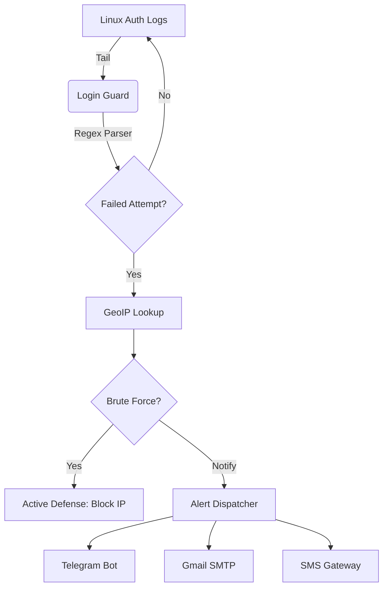

# Login Guard 🛡️

[](https://www.python.org/downloads/)
[](https://opensource.org/licenses/MIT)
[](#)

**Login Guard** is a lightweight, high-performance security daemon for Linux systems. It monitors authentication logs in real-time, provides GeoIP enrichment for failed attempts, and triggers instant multi-channel alerts (Telegram, Email, and SMS) while optionally taking active defensive measures to block attackers.


## ✨ Core Features

- 🔍 **Real-time Monitoring**: Continuously tails `/var/log/auth.log` for suspicious activity.
- 🌍 **GeoIP Enrichment**: Automatically identifies the country, city, and ISP of attackers.
- 🚨 **Multi-Channel Alerts**:
  - **Telegram**: Instant rich-text notifications.
  - **Email**: Detailed reports via Gmail SMTP.
  - **SMS**: Built-in support for Email-to-SMS gateways (No 3rd party APIs needed!).
- 🛡️ **Active Defense**: Automatically blocks malicious IPs using `ufw` or `iptables` after reaching a brute-force threshold.
- ⚙️ **Systemd Integration**: Runs as a robust background service with automatic recovery.
- 🧬 **Brute-Force Detection**: Intelligent tracking of repeated failures within configurable time windows.

## 🛠️ How it Works



## 🚀 Quick Setup

### 1. Installation
Run the automated installation script (requires sudo):
```bash
wget -qO- https://raw.githubusercontent.com/yourusername/login_guard/main/install.sh | sudo bash
```
*Or clone the repo manually and run `./install.sh`.*

### 2. Configuration
Edit your environment variables:
```bash
sudo nano /opt/login_guard/.env
```

| Variable | Description |
| :--- | :--- |
| `TELEGRAM_BOT_TOKEN` | Token from @BotFather |
| `TELEGRAM_CHAT_ID` | Your Chat ID |
| `GMAIL_APP_PASSWORD` | App-specific password for your Gmail |
| `ALERT_RECIPIENT_EMAIL` | Gateway address for SMS (e.g., `1234567890@vtext.com`) |
| `ENABLE_ACTIVE_DEFENSE` | Set to `true` to enable IP blocking |

### 3. Start Monitoring
```bash
sudo systemctl enable --now login_guard
```

## 🔒 Security & Best Practices

To keep your system secure while using Login Guard:

1. **Secure your `.env` file**: Ensure that your credentials are not readable by other users:
   ```bash
   sudo chmod 600 /opt/login_guard/.env
   ```
2. **Use a Dedicated Account**: For maximum safety, use a dedicated Gmail account specifically for these alerts rather than your primary personal email.
3. **App Passwords Only**: Never store your real Gmail password. Use a [Google App Password](https://myaccount.google.com/apppasswords).
4. **No Sensitive Data**: The alert messages only contain IP addresses and hostnames. Never modify the script to include passwords or sensitive user data in the alerts.

## 📱 Setting up SMS (No 3rd Party APIs)

Login Guard uses the **Email-to-SMS Gateway** method. This is safer than free SMS websites and requires no paid subscriptions.

1. **Find your carrier's gateway**:
   - **Verizon**: `number@vtext.com`
   - **AT&T**: `number@txt.att.net`
   - **T-Mobile**: `number@tmomail.net`
2. **Update your `.env`**: Set `ALERT_RECIPIENT_EMAIL` to your phone's gateway address.

---

## 🤝 Contributing

Contributions are welcome! Please feel free to submit a Pull Request.

1. Fork the Project
2. Create your Feature Branch (`git checkout -b feature/AmazingFeature`)
3. Commit your Changes (`git commit -m 'Add some AmazingFeature'`)
4. Push to the Branch (`git push origin feature/AmazingFeature`)
5. Open a Pull Request

## 📄 License
Distributed under the MIT License. See `LICENSE` for more information.
